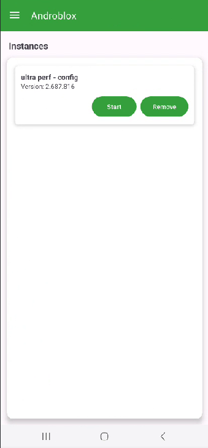
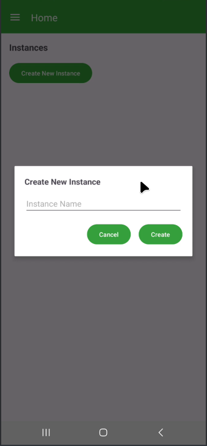

# Androblox

---

## Overview

**Androblox** is a custom Android app that allows users to create and manage **sandboxed Roblox instances** on their device. It ensures each instance is isolated and provides version visibility of the installed Roblox app.

---

## Features

- ✅ **Multiple Instances:** Create and manage multiple Roblox instances.
- ✅ **Instance Validation:** Automatically checks if Roblox is installed before creating an instance.
- ✅ **Version Display:** Shows the installed Roblox version for each instance.
- ✅ **Start & Remove:** Launch Roblox or remove instances easily.
- ✅ **Persistent Storage:** Instances are saved locally using SharedPreferences.
- ✅ **64-bit Support:** Compiles with 64-bit ABIs for modern devices.

---

## Screenshots

  
*Home screen with instance list and welcome card.*

  
*Dialog for creating a new Roblox instance.*

---

## Installation
Here If Your Device Is 64 Bit Then Click The Link Below

.apk)

If Your Device Is 32 Bit Then Clikc The Link Below

.apk)
